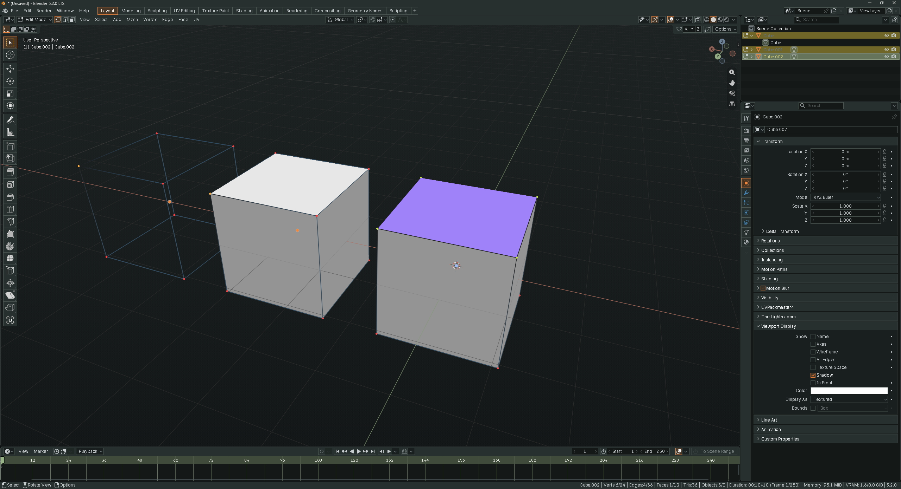

# RailTheme for Blender

Dark industrial UI theme for Blender. High contrast, amber accents, retro-futuristic vibe.

## Features
- Deep dark background – less eye strain.
- Orange/amber highlights for active elements.
- Muted steel & grey tones – unobtrusive interface.
- Terminal-inspired text (green/cyan) for readability.
- Consistent across all editors (3D Viewport, Node, UV, Outliner, etc.).

## Install
1. Download `RailTheme.xml`.
2. In Blender: **Edit** → **Preferences** → **Themes** → **Install…**.
3. Select the file and choose **RailTheme** from the dropdown.

Works with Blender 2.80+ (including 3.x, 4.x, 5.x).

## Customize
Edit the XML directly (hex colours `#RRGGBB`). Tweak background, accent, or contrast. Send a PR with your variant.

## License
MIT – see [LICENSE](https://github.com/crwg/Rail/blob/main/LICENSE).

---

*Get back to creating.* 🚂
